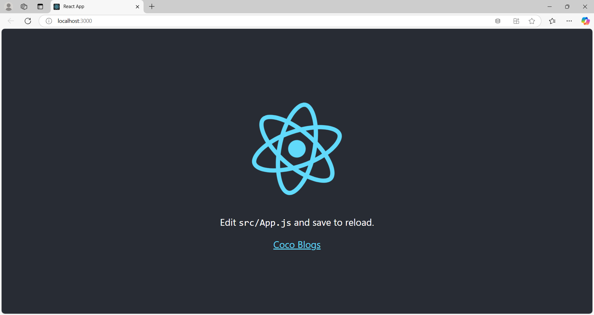

# CocoBlogs - Frontend

This is the frontend for a personal blogging project built with React. It provides a user-friendly interface for viewing, creating, and managing blog posts.

## Table of Contents

- [Features](#features)
- [Requirements](#requirements)
- [Installation](#installation)
- [Usage](#usage)
- [Folder Structure](#folder-structure)
- [API Endpoints](#api-endpoints)
- [Contributing](#contributing)
- [License](#license)

## Features

- User authentication and authorization
- Responsive design
- View all blog posts
- Create, edit, and delete blog posts
- Comment on blog posts
- Tagging system
- Pagination for blog posts

## Requirements

- Node.js 18+
- npm 11+

## Installation

1. Clone the repository:
    ```bash
    git clone https://github.com/AfshanAlamEngg/coco-blogs-frontend
    cd coco-blogs-frontend
    ```

2. Install the dependencies:
    ```bash
    npm install
    ```

3. Start the development server:
    ```bash
    npm start
    ```

## Final Output



## Usage

Open your browser and navigate to `http://localhost:3000` to view the application.

## Folder Structure

- `src/components/` - React components
- `src/pages/` - React pages
- `src/services/` - API service functions
- `src/styles/` - CSS and styled components
- `src/utils/` - Utility functions

## API Endpoints

The frontend interacts with the following API endpoints:

- `GET /api/posts/` - List all blog posts
- `POST /api/posts/` - Create a new blog post
- `GET /api/posts/{id}/` - Retrieve a specific blog post
- `PUT /api/posts/{id}/` - Update a specific blog post
- `DELETE /api/posts/{id}/` - Delete a specific blog post
- `POST /api/comments/` - Add a comment to a blog post

## Contributing

Contributions are welcome! Please open an issue or submit a pull request for any improvements or new features.

## License

This project is licensed under the MIT License. See the [LICENSE](LICENSE) file for more details.
